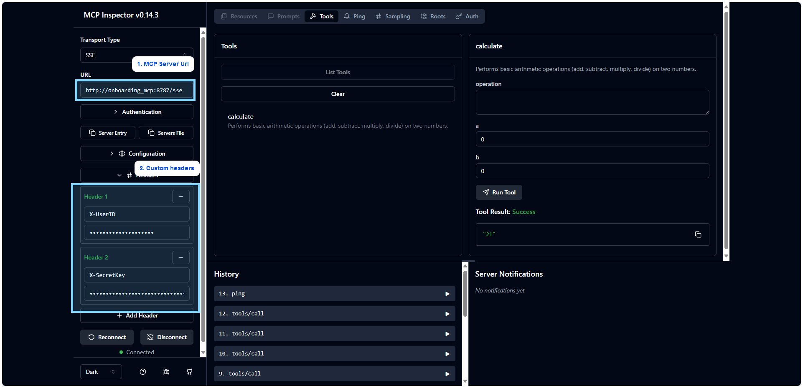

# MCP Inspector (Custom Headers) 
- This is customized **MCP Inspector** to support multiple headers.
- **Origin from:** https://github.com/popomore/inspector

# Setup Guide
- Start up **MCP Server**.
- Start up **MCP Inspector** via `docker compose up -d`.
- Access to UI via browser `http://127.0.0.1:6274`
- Set url based on MCP Server types
  - **Local:** `http://<CONTAINER NAME>:8787/sse`
  - **Remote:** `http://<REMOTE SERVER URL>:8787/sse`

